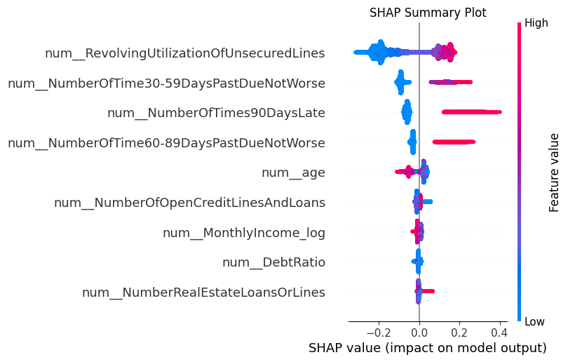

# AutoML Pipeline with Explainability

This project implements a modular AutoML Pipeline designed to work across diverse tabular datasets. The pipeline automatically handles:

- **Data preprocessing** (imputation, scaling, optional PCA, etc.)
- **Feature engineering** (derived features like log transforms)
- **Model selection** (Logistic Regression, Random Forest, XGBoost, Stacking)
- **Hyperparameter tuning** using Optuna.
- **Class imbalance handling** using SMOTE.

---

## Project Overview

- **Dataset:** [Give Me Some Credit (Kaggle)](https://www.kaggle.com/c/GiveMeSomeCredit)
- **Goal:** Predict if a borrower will experience serious delinquency within 2 years.
- **Pipeline Highlights:**
    - Data preprocessing with imputation, scaling, and feature engineering
    - Model selection and hyperparameter optimization using **Optuna**
    - Handles class imbalance using **SMOTE**
    - Supports optional **PCA** for dimensionality reduction
    - Explainability with SHAP (global feature importance)
    - Counterfactual explanations with **DiCE** (local actionable explanations)

---

## Project Structure

```
.
├── data_preprocessing.py      # Data cleaning and profiling
├── automl_pipeline.py         # Core AutoML pipeline
├── explainability.py          # SHAP + Counterfactual generation
├── requirements.txt           # Required dependencies
├── cleaned_credit_data.csv    # Processed data
├── automl_pipeline.pkl        # Trained pipeline
├── shap_summary.png           # SHAP summary plot
├── automl_pipeline.log        # Pipeline execution log
├── README.md                   # Project documentation
```

---

## How to Run

### 1. Install Dependencies
```bash
pip install -r requirements.txt
```

### 2. Data Preprocessing
```bash
python data_preprocessing.py
```
- Cleans and prepares `cleaned_credit_data.csv`
- Generates `credit_data_profile.html` (exploratory data analysis)

### 3. AutoML Pipeline Execution
```bash
python automl_pipeline.py
```
- Runs Optuna for 100 trials.
- Saves best model as `automl_pipeline.pkl`.
- Logs all details to `automl_pipeline.log`.

### 4. Explainability Analysis
```bash
python explainability.py
```
- Produces `shap_summary.png`.
- Attempts to generate `counterfactual_explanation.csv` (if feasible).

---

## Pipeline Workflow

| Step | Process |
|---|---|
| 1 | Load and clean data |
| 2 | Preprocessing (imputation, scaling, optional PCA) |
| 3 | Apply **SMOTE** for imbalance handling |
| 4 | Train + Evaluate Logistic Regression, Random Forest, XGBoost, Stacking Ensemble |
| 5 | Optimize hyperparameters using **Optuna** |
| 6 | Select best model based on **ROC AUC** |
| 7 | Save final pipeline to `automl_pipeline.pkl` |

---

## Key Results

| Metric | Value |
|---|---|
| Best ROC AUC | 0.8523 |
| Best Model | Random Forest |
| Best Params | `n_estimators=83`, `max_depth=6` |

Full optimization log: `automl_pipeline.log`

---

## SHAP Summary Plot

This plot shows the global importance of each feature.



### Top 5 Features (by SHAP Importance)
| Feature | Importance |
|---|---|
| RevolvingUtilizationOfUnsecuredLines | Very High |
| NumberOfTime30-59DaysPastDueNotWorse | High |
| NumberOfTimes90DaysLate | High |
| Age | Medium |
| MonthlyIncome_log | Medium |

---

## Counterfactual Explanations

DiCE is used to answer:
> "What minimal changes would flip the prediction from default to no-default?"

Example (if feasible):
| Feature | Original | Counterfactual |
|---|---|---|
| Age | 45 | 60 |
| MonthlyIncome_log | 8.5 | 9.2 |
| NumberOfTime30-59DaysPastDueNotWorse | 2 | 0 |

If no valid counterfactuals can be generated (model is extremely confident), the system gracefully logs:
```
No valid counterfactuals could be generated.
```

---

## Improvements (Future Work)

| Area | Suggestion |
|---|---|
| Fairness Analysis | Check for demographic bias (e.g., age, gender) |
| Probability Calibration | Apply Platt Scaling or Isotonic Regression if needed |
| Feature Engineering | Add interaction terms (e.g., Debt-to-Income Ratio) |
| Deployment | Package into a REST API for real-time inference |

---

## References

- [Give Me Some Credit Dataset](https://www.kaggle.com/c/GiveMeSomeCredit)
- [Optuna Documentation](https://optuna.readthedocs.io)
- [SHAP Documentation](https://shap.readthedocs.io)
- [DiCE Documentation](https://github.com/interpretml/DiCE)

---